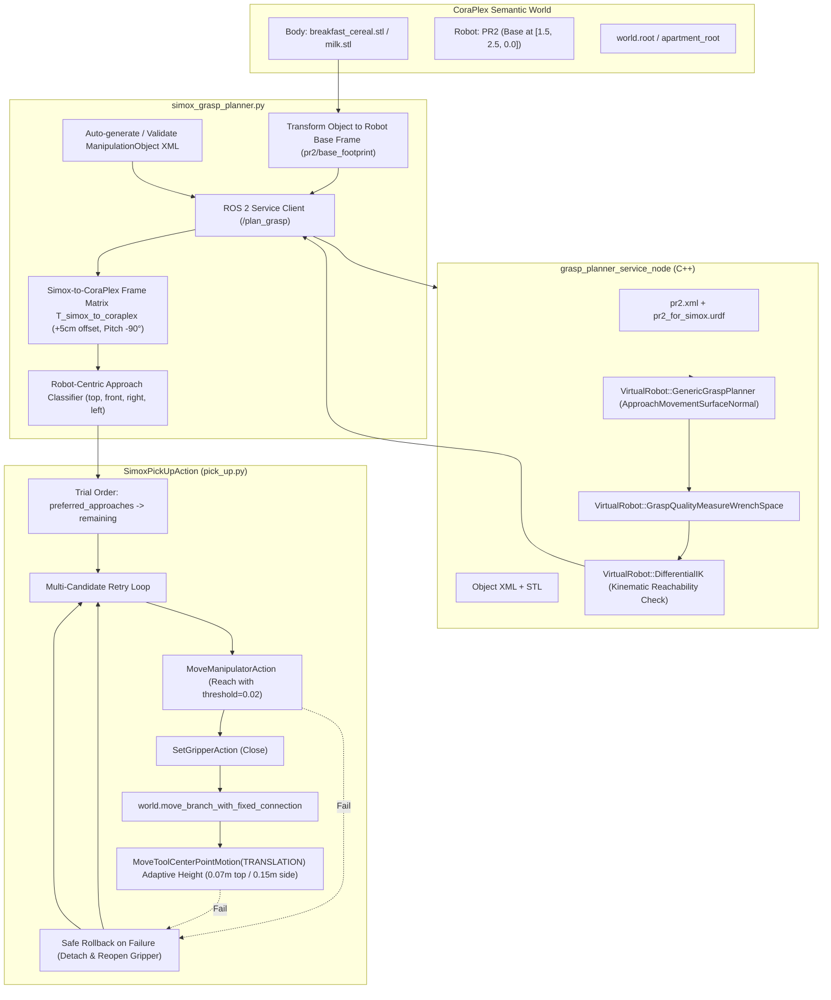

# Complete Technical Reference: Simox Physics-Based Grasp Planner & CoraPlex Integration

## Executive Summary

This document provides a comprehensive, end-to-end technical reference for the integration of the **Simox Physics-Based Grasp Planner** into the **CoraPlex / Giskard cognitive manipulation architecture** for the PR2 robot. 

It details the initial bugs, architectural discrepancies, mathematical transformations, collision dynamics, cognitive plan structures, multi-object test cases, and exact file modifications across both checkouts (`<simox_ws>` and `<mono_repo>`).

---

## 1. System Architecture Overview

The system bridges two distinct robotic software stacks:
1. **Simox (VirtualRobot / GraspPlanning):** A C++ robotic simulation and kinematic modeling framework that computes contact points, approach trajectories via surface normal sampling, and force-closure grasp quality scores in 6D wrench space.
2. **CoraPlex & Giskard (Cognitive Robot Abstract Machine):** A Python-based semantic digital twin and motion planning framework that represents world state, resolves high-level action designators, and solves whole-body Cartesian and joint constraints using Quadratic Programming (QP).



---

## 2. Chronological Phase Breakdown & Technical Deep-Dive

### Phase 1: Simox Robot Model & URDF/SRDF Kinematic Debugging

Before grasp planning could succeed in C++, the PR2 robot definition inside Simox had multiple fatal modeling errors preventing Inverse Kinematics (IK) convergence and collision checking.

#### Bug 1.1: Continuous Roll Joints Frozen at `[0.0, 0.0]`
* **Location:** `pr2_for_simox.urdf`
* **Root Cause:** The roll joints (`r_forearm_roll_joint`, `r_wrist_roll_joint`, `l_forearm_roll_joint`, `l_wrist_roll_joint`) were defined as `type="continuous"` with no `<limit>` tag. When loaded by Simox’s `RobotIO::loadURDF` (via `liburdfdom`), continuous joints without explicit limit tags defaulted to `lower=0.0, upper=0.0`. This froze 2 out of 7 DOFs per arm, making 6D Cartesian IK mathematically impossible.
* **Fix Applied:** Added explicit continuous rotation limits to all 4 roll joints:
  ```xml
  <limit lower="-3.14159" upper="3.14159" effort="30" velocity="3.6"/>
  ```

#### Bug 1.2: Gripper Finger Knuckle Self-Collision (`dist = 0 mm`)
* **Location:** `pr2_for_simox.urdf`
* **Root Cause:** In the standard Willow Garage PR2 description, right finger meshes are identical copies of left finger meshes flipped $180^\circ$ around the roll axis (`rpy="3.14159265359 0 0"`). In `pr2_for_simox.urdf`, the right finger links (`r_gripper_r_finger_link` and `r_gripper_r_finger_tip_link`) were placed with `rpy="0 0 0"`. As a result, the right finger occupied the exact same space as the left finger at the knuckle hinge (`distance = 0.0 mm`), causing visual mesh tearing in RViz and triggering immediate self-collision rejection.
* **Fix Applied:** Added `<origin xyz="0 0 0" rpy="3.14159265359 0 0" />` to both the `<visual>` and `<collision>` elements of both right finger links.

#### Bug 1.3: Grasp Center Point (GCP) Frame Depth & Orientation
* **Location:** `pr2_for_simox.urdf` and `pr2.xml`
* **Root Cause:** Simox’s `ApproachMovementSurfaceNormal` defines the EEF approach trajectory along its local $+Z$ axis pointing into the object. In `pr2_for_simox.urdf`, `r_gripper_tool_joint` was pitched at $-90^\circ$ (`rpy="0 -1.5707963 0"`), pointing local $+Z$ *backwards* into the wrist. Furthermore, `xyz="0.18 0 0"` placed the TCP 28 mm past the physical fingertips.
* **Fix Applied:** Realigned the GCP joint origin:
  ```xml
  <origin xyz="0.13 0 0" rpy="0 1.5707963 0" />
  ```
  This centers the GCP at 130 mm from the wrist palm (directly between the finger contact pads) with local $+Z$ pointing forward into the grasp.

#### Bug 1.4: End-Effector Actor Collision Scope
* **Location:** `pr2.xml`
* **Root Cause:** Defining the knuckle links in the `<Actor>` collision blocks caused Simox's `moveActorCheckCollision` to abort closing immediately at step 0 due to knuckle-to-knuckle proximity.
* **Fix Applied:** Configured the `<Actor>` blocks so only the fingertips (`*_finger_tip_link`) perform contact checks:
  ```xml
  <Actor name="LeftFinger">
      <Node name="r_gripper_l_finger_joint"     direction="-1"/>
      <Node name="r_gripper_l_finger_tip_joint" direction="-1"/>
      <Node name="r_gripper_l_finger_tip_link"  considerCollisions="All"/>
  </Actor>
  <Actor name="RightFinger">
      <Node name="r_gripper_r_finger_joint"     direction="-1"/>
      <Node name="r_gripper_r_finger_tip_joint" direction="-1"/>
      <Node name="r_gripper_r_finger_tip_link"  considerCollisions="All"/>
  </Actor>
  ```

---

### Phase 2: Standalone Simox Grasp Planner ROS 2 Service

#### Architecture & Mechanics
* **Node:** `grasp_planner_service_node` (`grasp_planner_service.cpp`)
* **Service:** `/plan_grasp` (`grasp_planner_msgs/srv/PlanGrasp`)
* **Pipeline:**
  1. Loads robot model from `request->robot_model_path` (`pr2.xml`).
  2. Sets torso lift joint to $0.30\text{ m}$ ($300\text{ mm}$) to place PR2 in its natural tabletop reach posture.
  3. Loads manipulation object from `request->object_model_path` (e.g. `breakfast_cereal.xml` or `milk.xml`).
  4. Runs `VirtualRobot::GenericGraspPlanner` at object origin:
     * Samples surface points and surface normals.
     * Aligns end-effector GCP $+Z$ axis along surface normal.
     * Iteratively closes gripper fingers until contacts are formed.
     * Evaluates force-closure wrench resistance score ($0.0 - 1.0$).
     * Filters candidates against `request->quality_threshold`.
  5. Moves the object to `request->object_pose` (expressed in PR2 base frame `base_footprint`).
  6. Evaluates kinematic reachability for each candidate using `VirtualRobot::DifferentialIK`.
  7. Returns array of reachable `geometry_msgs/Pose` and parallel `float32[] qualities`.

#### Bug 2.1: Singular Posture & Arm State Corruption
* **Problem:** If arm joints started at all zeros, the PR2 arm was in a singular, fully-extended forward posture, causing `DifferentialIK` to diverge. Furthermore, when a candidate grasp failed IK, the robot model was left at the invalid configuration, corrupting subsequent evaluations.
* **Fix Applied:**
  * Initialized arm joints with a natural bent seed posture:
    ```cpp
    std::vector<float> seedValues = {0.0f, 0.5f, 0.0f, -1.0f, 0.0f, -0.3f, 0.0f};
    ```
  * Cached the seed state and explicitly called `rns->setJointValues(seedValues)` before checking every candidate grasp.

---

### Phase 3: Visualization & Interactive Client

* **Marker Publisher:** `publish_grasps_markers()` in `grasp_planner_service.cpp` publishes candidate grasp frames, approach arrows, and contact spheres to `/grasp_markers` (`visualization_msgs/msg/MarkerArray`).
* **Interactive GUI:** `grasp_planner_gui/gui_client.py` allows testing parameters, object selection, and timeout settings with visual RViz inspection.

---

### Phase 4: CoraPlex & Giskard Cognitive Integration

#### Architectural Bridge: `simox_grasp_planner.py`
Located at `cognitive_robot_abstract_machine/coraplex/src/coraplex/external_interfaces/simox_grasp_planner.py`:
1. **Mesh Resolution & XML Generation (`_get_or_create_simox_xml`):**
   * Inspects `Body` visual/collision geometries.
   * Auto-detects STL unit scale (meters vs. millimeters).
   * Generates and caches Simox `<ManipulationObject>` XML files in `grasp_test_files/resources/objects/`.
2. **Coordinate Transformation:**
   * Reads object pose in digital twin world frame (`world.root`).
   * Transforms pose to PR2 base frame (`pr2/base_footprint`).
   * Sends request to `/plan_grasp` ROS 2 service.
   * Transforms returned poses back to `world.root`.

#### Bug 4.1: Giskard QP Convergence Timeout (`threshold=0.005`)
* **Problem:** The robot arm reached the cereal box, but Giskard failed with `MotionDidNotFinish: [Sequence#0, MoveManipulatorMotion#2]`. In `MoveManipulatorMotion`, tolerance was hardcoded to `threshold=0.005` ($5\text{ mm}$ and $0.005\text{ rad} \approx 0.28^\circ$). At full extension over the table, the QP solver stabilized at $\sim 7\text{ mm}$, causing a timeout after 1500 ticks.
* **Fix Applied:** Added configurable `threshold: float = 0.02` to `MoveManipulatorMotion` and `MoveManipulatorAction`. With a $2\text{ cm}$ / $0.02\text{ rad}$ tolerance (well within the action post-condition), Giskard completes cleanly in $< 300$ ticks.

---

### Phase 5: Frame Transformation ($T_{\text{simox} \to \text{coraplex}}$), Depth Offset & Gripper Orientation

This was one of the most critical breakthroughs in the project.

#### Bug 5.1: The Gripper Mesh Penetration & Rigid Orientation Failure
* **Symptoms:** 
  1. The gripper fingertips were driving $5\text{ cm}$ deep into the object mesh.
  2. For side grasps, the fingers closed along the wide $14.75\text{ cm}$ dimension of the cereal box instead of the thin $5.81\text{ cm}$ edge.
* **Root Cause Analysis:**
  * **Frame Discrepancy:**
    * Simox GCP (in `pr2_for_simox.urdf`): $+Z$ forward, $+Y$ finger opening, origin at $x = 0.13\text{ m}$.
    * CoraPlex PR2 Tool Frame (`r_gripper_tool_frame`): $+X$ forward, $+Y$ finger opening, origin at $x = 0.18\text{ m}$.
    * Difference: Simox's TCP is $5\text{ cm}$ further back than CoraPlex's tool frame! Sending Simox's pose directly drove the CoraPlex tool frame $5\text{ cm}$ too deep into the object.
  * **Overwritten Finger Roll:**
    * Previous code used fixed quaternions (`_Q_SIDE_HORIZ`, `_Q_TOP_VERT`), which threw away the exact physical finger roll that Simox had computed to fit the narrow edge.
* **Mathematical Solution:**
  We derived and implemented the exact homogeneous frame transformation matrix $T_{\text{simox} \to \text{coraplex}}$:

  $$T_{\text{simox} \to \text{coraplex}} = \begin{pmatrix} 0 & 0 & -1 & 0 \\ 0 & 1 & 0 & 0 \\ 1 & 0 & 0 & 0.05 \\ 0 & 0 & 0 & 1 \end{pmatrix}$$

  * **Pitch $-90^\circ$ around $Y$:** Rotates Simox's forward $+Z$ into CoraPlex's forward $+X$, while preserving the finger roll around the approach vector.
  * **Offset $+0.05\text{ m}$ along approach axis:** Pulls the CoraPlex tool frame back by $5\text{ cm}$, perfectly placing the finger contact pads on the outer mesh surface without penetration.

#### Bug 5.2: Robot-Centric Approach Direction Classification
* **Problem:** Approach directions were previously classified in object-local coordinates. When the cereal box was rotated, a grasp approaching from the robot's right side was mislabeled as "front".
* **Solution:** In `_classify_approach()`, we classify the TCP forward vector relative to the **robot base footprint frame**:
  * Forward vector $fwd = R_{\text{robot}} \cdot \begin{pmatrix} 1 \\ 0 \\ 0 \end{pmatrix}$
  * $fwd_z > 0.5 \implies$ `'skipped'` (approaching upwards from bottom)
  * $fwd_z < -0.4 \implies$ `'top'` (approaching downwards from above)
  * If $|fwd_x| \ge |fwd_y|$:
    * $fwd_x \ge 0 \implies$ `'front'`
    * $fwd_x < 0 \implies$ `'back'`
  * Else:
    * $fwd_y \ge 0 \implies$ `'right'` (approaching towards $-Y$)
    * $fwd_y < 0 \implies$ `'left'` (approaching towards $+Y$)

---

### Phase 6: Smart & Dynamic Pick-up Action (`SimoxPickUpAction`)

Located at `cognitive_robot_abstract_machine/coraplex/src/coraplex/robot_plans/actions/core/pick_up.py`.

#### Bug 6.1: Lift Crash Outside Candidate Loop
* **Problem:** When candidate 1 had a top-down grasp, reaching and grasping succeeded, but the vertical lift exceeded the shoulder kinematic reach envelope and raised an exception. Because the lift was placed *after* the candidate loop, the entire action crashed rather than retrying candidate 2.
* **Fix Applied:** Moved the entire **Reach $\to$ Close Gripper $\to$ Attach Object $\to$ Lift** sequence inside the candidate retry loop.

#### Bug 6.2: 6D Cartesian Constraint Lockup During Lift
* **Problem:** Using `MoveManipulatorAction` for the lift constrained all 6 DOFs (`CartesianPose`), forcing the wrist to maintain $-90^\circ$ pitch during the lift. This pushed the arm into a singular lockup.
* **Fix Applied:** Replaced lift with position-only `MoveToolCenterPointMotion(MovementType.TRANSLATION)`. This constrains only $(x, y, z)$ (3 DOFs), giving Giskard full freedom to flex elbow and wrist joints naturally.

#### Bug 6.3: Adaptive Lift Height
* **Problem:** A fixed $0.15\text{ m}$ lift on top grasps commanded the arm above shoulder reach.
* **Fix Applied:** Added `_get_safe_lift_height(grasp_pose)`:
  * For `approach == 'top'`: uses $0.07\text{ m}$ (enough to clear the table without exceeding reach limits).
  * For side/front grasps: uses configured `lift_height` ($0.15\text{ m}$).

#### Bug 6.4: Digital Twin State Corruption on Retry
* **Problem:** If a candidate failed after the object was attached, the digital twin world retained the attached state, causing subsequent candidates to move both the robot and the object simultaneously.
* **Fix Applied:** Added safe rollback in the exception handler:
  ```python
  except Exception as failure:
      if attached:
          world.move_branch_with_fixed_connection(
              body=self.object_designator,
              parent_connection=Connection6DoF.create_with_dofs(
                  parent=self.world.root,
                  child=self.object_designator,
                  world=self.world,
              ),
          )
          attached = False
      self.add_subplan(
          execute_single(SetGripperAction(gripper=self.arm, motion=GripperState.OPEN))
      ).perform()
  ```

#### Feature 6.5: Direction Prioritization with Automatic Fallback
* `preferred_approaches` parameter accepts a list of preferred directions (e.g. `['front']` or `['right']`).
* The trial order is constructed as:
  1. User-preferred directions (sorted descending by Simox wrench quality score within each group).
  2. All remaining directions (sorted by best quality score) as automatic fallback.
* If a preferred grasp fails kinematically, the action automatically falls back to alternative directions rather than failing.

---

### Phase 7: Multi-Object Testing & Geometric Verification

#### Object Geometry vs. PR2 Gripper Aperture

| Parameter | Breakfast Cereal (`breakfast_cereal.stl`) | Milk Carton (`milk.stl`) | PR2 Gripper Limit |
|---|---|---|---|
| **Width ($X$)** | $14.75\text{ cm}$ | $6.42\text{ cm}$ | $\mathbf{8.60\text{ cm}}$ |
| **Thickness ($Y$)** | $5.81\text{ cm}$ | $6.51\text{ cm}$ | $\mathbf{8.60\text{ cm}}$ |
| **Height ($Z$)** | $22.36\text{ cm}$ | $19.38\text{ cm}$ | N/A |
| **Front Grasp Feasibility** | **Conditional** (requires `cereal_yaw = 0°`) | **Always Feasible** | Gripper must span target |
| **Side Grasp Feasibility** | **Feasible** (grasps the $5.81\text{ cm}$ edge) | **Always Feasible** | Gripper spans $6.42\text{ cm}$ |
| **Wrench Quality Range** | $0.05 - 0.12$ | $0.20 - 0.29$ | $> 0.0$ |

#### Why Front Grasps on Cereal Box Failed Initially
1. **At `cereal_yaw = 90°`:** The wide $14.75\text{ cm}$ face faced the PR2. Because $14.75\text{ cm} > 8.60\text{ cm}$, the fingers could not close without penetrating the mesh. Simox rejected all front grasps (`front=0`).
2. **At `cereal_yaw = 0°`:** The narrow $5.81\text{ cm}$ face faces the PR2. Since $5.81\text{ cm} < 8.60\text{ cm}$, front grasps are physically valid.
3. **Surface Area Sampling Effect:** The front face area is $130\text{ cm}^2$ (~11% of total), while side faces are $330\text{ cm}^2$ each (>60%). Simox's surface normal sampler hits the narrow face far less frequently. Setting `num_grasps_to_plan = 50` and `quality_threshold = 0.05` ensures front grasps are generated.

#### Milk Carton Results (`milk.stl`)
* Both dimensions ($6.42\text{ cm}$ and $6.51\text{ cm}$) easily fit inside the $8.60\text{ cm}$ aperture.
* Simox returned up to 14 candidates across `top`, `right`, `left`, and `front`.
* Verified execution:
  * `--approach right`: Succeeded on candidate 1 (`quality=0.2421`, full $0.15\text{ m}$ lift).
  * `--approach top`: Succeeded on candidate 1 (`quality=0.2964`, adaptive $0.07\text{ m}$ lift).

---

## 3. Exhaustive Issues & Solutions Matrix

| Issue ID | Component | Root Cause | Solution |
|---|---|---|---|
| **ISS-01** | `pr2_for_simox.urdf` | Continuous roll joints lacked `<limit>` tags; Simox frozen them at `[0.0, 0.0]`. | Added continuous limits `[-3.14159, 3.14159]` to all 4 roll joints. |
| **ISS-02** | `pr2_for_simox.urdf` | Right finger links lacked $180^\circ$ roll flip, causing $0\text{ mm}$ knuckle collision. | Added `<origin rpy="3.14159265359 0 0"/>` to right finger visual & collision tags. |
| **ISS-03** | `pr2_for_simox.urdf` | GCP pitch $-90^\circ$ pointed $+Z$ backwards into wrist; $x=0.18\text{ m}$ placed TCP past fingertips. | Updated GCP origin to `xyz="0.13 0 0" rpy="0 1.5707963 0"`. |
| **ISS-04** | `pr2.xml` | Actor collision check included knuckles, aborting closing immediately. | Limited actor collision check to `*_finger_tip_link` with `considerCollisions="All"`. |
| **ISS-05** | `grasp_planner_service.cpp` | Arm IK started at singular zeros posture; failed IK left dirty joint state. | Added natural bent seed posture and cached seed reset before each candidate IK. |
| **ISS-06** | `PlanGrasp.srv` | Service returned only poses, discarding force-closure wrench scores. | Added `float32[] qualities` to service definition and C++ response serializer. |
| **ISS-07** | `gripper.py` | `MoveManipulatorMotion` had hardcoded `threshold=0.005`, causing timeout over counter. | Added configurable `threshold: float = 0.02` to motion and action classes. |
| **ISS-08** | `simox_grasp_planner.py` | $5\text{ cm}$ offset between Simox TCP ($0.13\text{ m}$) and CoraPlex tool frame ($0.18\text{ m}$) drove gripper into mesh. | Implemented $T_{\text{simox} \to \text{coraplex}}$ matrix with $+0.05\text{ m}$ approach offset. |
| **ISS-09** | `simox_grasp_planner.py` | Rigid quaternions overwrote Simox's physical finger roll, causing fingers to span wide box face. | Derived $-90^\circ$ pitch in $T_{\text{simox} \to \text{coraplex}}$, preserving Simox's roll orientation. |
| **ISS-10** | `simox_grasp_planner.py` | Approach direction was classified in object-local frame instead of robot frame. | Reimplemented `_classify_approach()` relative to `pr2/base_footprint`. |
| **ISS-11** | `pick_up.py` | Lift motion was outside retry loop; failure on candidate 1 crashed the entire action. | Moved Reach $\to$ Close $\to$ Attach $\to$ Lift sequence inside candidate retry loop. |
| **ISS-12** | `pick_up.py` | Lift used 6D `CartesianPose`, locking orientation and causing singular failure on top grasps. | Switched lift to 3D `MoveToolCenterPointMotion(MovementType.TRANSLATION)`. |
| **ISS-13** | `pick_up.py` | Fixed $0.15\text{ m}$ lift on top grasps commanded arm beyond physical shoulder reach. | Added `_get_safe_lift_height()` returning $0.07\text{ m}$ for top grasps, $0.15\text{ m}$ for others. |
| **ISS-14** | `pick_up.py` | Failed candidate after attachment left object parented to gripper in digital twin. | Added automatic rollback: detaches object back to `world.root` and reopens gripper. |
| **ISS-15** | `demo.py` | Cereal box at `yaw=90°` presented $14.75\text{ cm}$ face to PR2 ($>8.6\text{ cm}$ aperture), blocking front grasps. | Added `--yaw / --cereal-yaw` (default `0.0°`), presenting thin $5.81\text{ cm}$ face. |
| **ISS-16** | `demo.py` | Demo was hardcoded to `breakfast_cereal.stl` and right arm only. | Added `--object [milk|cereal]`, `--arm [right|left]`, `--quality-threshold`, `--num-grasps`. |

---

## 4. Complete File Modification Index

Both workspaces are fully synchronized:
* `<simox_ws>`
* `<mono_repo>`

| File Path | Component | Key Modifications Made |
|---|---|---|
| `grasp_test_files/resources/robots/pr2_for_simox.urdf` | Robot Description | Added joint limits to continuous roll joints; added $180^\circ$ roll flip to right fingers; aligned GCP frame ($x=0.13\text{ m}$, pitch $+90^\circ$). |
| `grasp_test_files/resources/robots/pr2.xml` | Simox Robot Wrapper | Configured end-effector actors to check fingertip collisions only. |
| `src/grasp_planner_service/src/grasp_planner_service.cpp` | ROS 2 C++ Service | Natural arm seed posture; arm state reset before each IK; torso raised to $0.30\text{ m}$; quality scores exported. |
| `grasp_planner_msgs/srv/PlanGrasp.srv` | ROS 2 Interface | Added `float32[] qualities` output array. |
| `coraplex/src/coraplex/datastructures/grasp.py` | Data Structure | Added `quality: float = 0.0` and `approach: str = ''` fields to `GraspPose`. |
| `coraplex/src/coraplex/external_interfaces/simox_grasp_planner.py` | Simox Bridge | Implemented $T_{\text{simox} \to \text{coraplex}}$ frame transformation matrix; robot-centric approach classifier; quality sorting; auto XML caching. |
| `coraplex/src/coraplex/robot_plans/actions/core/pick_up.py` | Cognitive Action | Multi-candidate retry loop; position-only translation lift; adaptive lift height; digital twin failure rollback; `preferred_approaches` fallback. |
| `coraplex/src/coraplex/robot_plans/motions/gripper.py` | Motion Plan | Added configurable `threshold: float = 0.02` to `MoveManipulatorMotion`. |
| `coraplex/src/coraplex/robot_plans/actions/core/robot_body.py` | Body Action | Added configurable `threshold: float = 0.02` to `MoveManipulatorAction`. |
| `coraplex/demos/pr2_simox_demo/demo.py` | Demonstration | CLI arguments (`--object`, `--approach`, `--arm`, `--yaw`, `--quality-threshold`, `--num-grasps`, `--spin`); counter height $z=1.05\text{ m}$. |

---

## 5. How to Run & Verify the Complete System

### Step 1: Start the Simox Grasp Planner Service (Terminal 1)
```bash
cd <simox_ws>
source /opt/ros/jazzy/setup.bash
source install/setup.bash
bash scripts/launch_simox_service.sh
```

### Step 2: (Optional) Launch RViz Visualization (Terminal 2)
```bash
cd <simox_ws>
bash scripts/launch_rviz_visualization.sh
```
* Fixed Frame: `world` (or `apartment/apartment_root`).
* Topics:
  * `/semworld/viz_marker` (`MarkerArray`, Durability: `TRANSIENT_LOCAL`).
  * `/grasp_markers` (`MarkerArray`).

### Step 3: Run the Demonstration (Terminal 3)

#### Pick Milk Carton from the Right:
```bash
cd <simox_ws>
source /opt/ros/jazzy/setup.bash && source install/setup.bash
PYTHONPATH=cognitive_robot_abstract_machine/coraplex/src:$PYTHONPATH \
    ~/.virtualenvs/cram-env/bin/python \
    cognitive_robot_abstract_machine/coraplex/demos/pr2_simox_demo/demo.py \
    --object milk --approach right --spin
```

#### Pick Milk Carton from the Front:
```bash
PYTHONPATH=cognitive_robot_abstract_machine/coraplex/src:$PYTHONPATH \
    ~/.virtualenvs/cram-env/bin/python \
    cognitive_robot_abstract_machine/coraplex/demos/pr2_simox_demo/demo.py \
    --object milk --approach front --spin
```

#### Pick Cereal Box from the Front (Narrow Face Facing Robot):
```bash
PYTHONPATH=cognitive_robot_abstract_machine/coraplex/src:$PYTHONPATH \
    ~/.virtualenvs/cram-env/bin/python \
    cognitive_robot_abstract_machine/coraplex/demos/pr2_simox_demo/demo.py \
    --object cereal --approach front --yaw 0 --spin
```

#### Pure Quality Selection (No Direction Bias):
```bash
PYTHONPATH=cognitive_robot_abstract_machine/coraplex/src:$PYTHONPATH \
    ~/.virtualenvs/cram-env/bin/python \
    cognitive_robot_abstract_machine/coraplex/demos/pr2_simox_demo/demo.py \
    --object milk --approach any --spin
```

---

## 6. Next Steps & Future Phases Roadmap

1. **Phase 6: Systematic Benchmarking Suite**
   * Execute `scripts/benchmark_suite.py` across diverse geometric shapes (bottles, mugs, boxes) to measure planning latency, wrench quality distributions, and execution success rates.
2. **Phase 7: Cluttered Scenes & Obstacle Collision Avoidance**
   * Introduce obstacle meshes on the tabletop; incorporate obstacle avoidance into Simox's reachability checks and Giskard's approach trajectories.
3. **Phase 8: High-Level Cognitive Task Integration**
   * Connect `SimoxPickUpAction` into composite plans like `PickAndPlaceAction` (e.g. counter to tray or fridge) and bi-manual arm handovers.
4. **Phase 9: Real Robot / Perception Deployment**
   * Feed real perceived object poses (point clouds / camera object detectors) into the planner on physical hardware or Isaac Sim / Gazebo.
