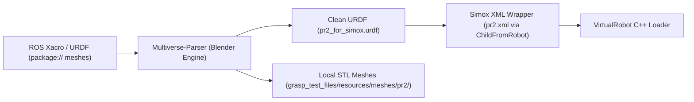
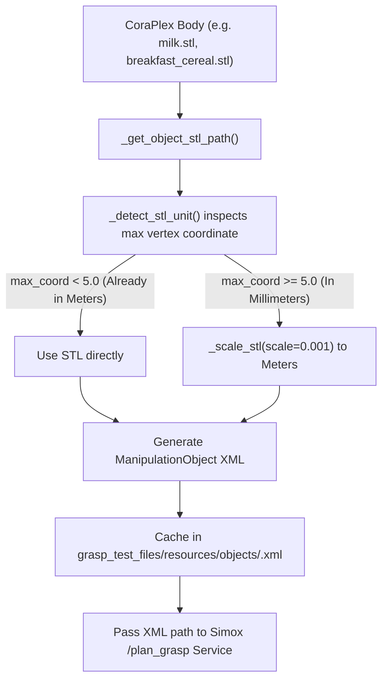

# Bridging Simox (.iv / Simox XML) and the ROS Mono-Repo (.stl / URDF)

## Executive Summary

Historically, the **Simox** suite (VirtualRobot, GraspStudio, Saba) was designed around the **Open Inventor (`.iv`)** and **VRML (`.wrl`)** 3D scene formats, using proprietary `<Robot>` and `<ManipulationObject>` XML structures natively developed at KIT.

In contrast, the modern **ROS / CoraPlex mono-repo** operates strictly on:
* **URDF / Xacro** with ROS `package://` mesh URIs.
* Binary **STL** or **DAE (Collada)** meshes.
* Strict **MKS units (meters, radians)**.
* **RViz2 / TF** for rendering and transform state.

This document details how we bridged these two fundamentally different ecosystems without requiring manual mesh conversions to `.iv` for every robot or object.

---

## 1. The Core Discrepancies

| Aspect | Legacy Simox Ecosystem | Modern ROS / CoraPlex Mono-Repo | Conflict / Challenge |
|---|---|---|---|
| **Mesh Format** | Open Inventor (`.iv`), VRML (`.wrl`) | Binary STL (`.stl`), Collada (`.dae`) | Native Simox tutorials and examples rely on `.iv` files with Coin3D materials. |
| **Mesh Coordinate Units** | Millimeters ($1\text{ unit} = 1\text{ mm}$) | Meters ($1\text{ unit} = 1\text{ m}$) | A $10\text{ cm}$ object in meters ($0.1$) loaded by an mm parser appears as $0.1\text{ mm}$ (invisible particle). Conversely, an mm mesh assumed to be meters appears $100\text{ m}$ tall. |
| **Robot Description** | Simox XML (`<Robot>`, `<RobotNode>`, `<EndEffector>`) | Unified Robot Description Format (`<robot>`, `<link>`, `<joint>`) | ROS tools cannot parse Simox XML; Simox cannot natively resolve ROS `package://` URIs without ROS plugins. |
| **Viewer / GUI** | Coin3D / `SoQt` native OpenGL window | RViz2 (`visualization_msgs/MarkerArray`, TF) | Coin3D / `SoQt` fails under modern Wayland / XWayland desktop environments ("ghost window" or GLX crashes). |

---

## 2. Solution Part 1: The Robot Model Bridge (`URDF` + `package://` $\to$ Simox)

In the mono-repo, the PR2 is defined via Xacro files in `iai_pr2_description`, referencing meshes as:
```xml
<mesh filename="package://iai_pr2_description/meshes/gripper_v0/l_finger.stl"/>
```
Simox's C++ parser (`VirtualRobot::RobotIO::loadXML`) cannot resolve `package://` URIs on its own, nor does it understand Xacro macros.

### The Conversion Pipeline
We designed an automated bridge in `scripts/convert_to_simox_ready.py` utilizing `Multiverse-Parser`:



1. **Mesh Resolution & Extraction:**
   * `Multiverse-Parser` resolves all `package://` paths using the active ROS workspace.
   * Meshes are extracted and placed into `grasp_test_files/resources/meshes/pr2/`.
2. **Clean URDF Generation (`pr2_for_simox.urdf`):**
   * Produces a clean, standalone URDF with relative mesh file paths.
   * Continuous roll joints are assigned explicit `[-3.14159, 3.14159]` limits so Simox does not freeze them at zero.
   * Right gripper finger links receive the $180^\circ$ roll flip (`rpy="3.14159265359 0 0"`) to eliminate the $0\text{ mm}$ knuckle collision.
3. **Simox XML Wrapper (`pr2.xml`):**
   * Instead of re-specifying all robot kinematics in Simox's verbose XML, Simox provides the `<ChildFromRobot>` tag:
   ```xml
   <Robot name="PR2" RootNode="base_footprint">
       <RobotNode name="base_footprint">
           <ChildFromRobot>
               <File importEEF="true">pr2_for_simox.urdf</File>
           </ChildFromRobot>
       </RobotNode>
       
       <!-- Simox End-Effector Definitions -->
       <EndEffector name="r_gripper" base="r_wrist_roll_link" tcp="r_gripper_tool_frame" gcp="r_gripper_tool_frame">
           <Preshape name="Open">
               <Node name="r_gripper_l_finger_joint" unit="radian" value="0.54"/>
               <Node name="r_gripper_r_finger_joint" unit="radian" value="0.54"/>
           </Preshape>
           <Actor name="LeftFinger">
               <Node name="r_gripper_l_finger_tip_link" considerCollisions="All"/>
           </Actor>
           <Actor name="RightFinger">
               <Node name="r_gripper_r_finger_tip_link" considerCollisions="All"/>
           </Actor>
       </EndEffector>
   </Robot>
   ```
   * **Result:** Zero Open Inventor (`.iv`) files needed for the robot! Simox parses the URDF directly and overlays end-effector definitions, preshapes, and kinematic chains on top.

---

## 3. Solution Part 2: The Object Mesh Bridge (Eliminating `.iv` for Objects)

In legacy Simox, every object had to be an `.iv` file (e.g. `WaterBottle.iv`, `test_cube.iv`) wrapped in a `<ManipulationObject>` XML.

In the CoraPlex mono-repo, all objects are stored as standard **binary STL files in meters** (e.g. `breakfast_cereal.stl`, `milk.stl`).

### Can Simox Load `.stl` Without `.iv`?
**Yes.** Simox’s underlying Coin3D loader (`CoinVisualizationNode`) includes a native binary STL parser. However, it exhibits a critical unit quirk:
* **The Simox STL Unit Rule:** Simox assumes any file loaded with `<File type="stl">` is defined in **METERS**, and it multiplies vertex coordinates by $1000$ internally to convert them into VirtualRobot's internal millimeter coordinate space.
* If a file is already in millimeters (or converted incorrectly), Simox multiplies it by $1000$ again, resulting in an object $1000\times$ too large ($100\text{ meters}$ across!).

### The Automated Zero-Manual-Work Pipeline
Instead of manually opening Blender or FreeCAD to export `.iv` files, we built an automatic caching bridge in `simox_grasp_planner.py` (`_get_or_create_simox_xml`):



### Auto-Generated `<ManipulationObject>` XML Format
When a body (such as `milk.stl` or `breakfast_cereal.stl`) is queried, `simox_grasp_planner.py` automatically writes:
```xml
<?xml version="1.0" encoding="UTF-8" ?>
<!-- Auto-generated by simox_grasp_planner.py for body: milk.stl -->
<ManipulationObject name="milk">
    <Visualization>
        <File type="stl">milk.stl</File>
    </Visualization>
    <CollisionModel>
        <File type="stl">milk.stl</File>
    </CollisionModel>
    <GraspSet name="Simox_r_gripper" RobotType="PR2" EndEffector="r_gripper"/>
    <GraspSet name="Simox_l_gripper" RobotType="PR2" EndEffector="l_gripper"/>
</ManipulationObject>
```

### Benefits of This Approach
1. **Completely `.iv`-Free:** Neither objects nor robots require Open Inventor format.
2. **Dynamic Support:** Any new object added to the digital twin (e.g. `cup.stl`, `bowl.stl`) is immediately graspable without any manual file conversion.
3. **Collision Compatibility:** Simox uses the exact same STL mesh for force-closure and contact checking that Giskard uses for collision avoidance.

---

## 4. Solution Part 3: The Visualization Bridge (Bypassing Coin3D/SoQt)

### The Legacy Simox Problem
Simox includes a standalone viewer based on Open Inventor / Coin3D / `SoQt`. On modern Linux distributions running Wayland:
* Launching the native Simox viewer resulted in **"Ghost Windows"** (transparent, unclickable frames) or OpenGL / GLX context initialization errors.
* The native viewer cannot display ROS TF frames, robot trajectory goals, or semantic digital twin objects.

### The Solution: Direct ROS 2 RViz Bridge
We completely bypassed the native Coin3D `.iv` viewer:
1. In `grasp_planner_service.cpp`, we implemented `publish_markers()` and `publish_object_marker()`:
   * **Grasp Poses & Quality:** Published as `visualization_msgs::msg::MarkerArray` to `/grasp_markers` (green-to-red colored approach arrows and coordinate frames).
   * **Robot Structure:** Published as native ROS URDF visuals and TF frames.
2. In CoraPlex, `VizMarkerPublisher` publishes all digital twin bodies and robot links to `/semworld/viz_marker` (`TRANSIENT_LOCAL`).
3. **Result:** Full 3D interactive inspection in standard **RViz2** without any Open Inventor dependency.

---

## 5. Summary of Key Files

| File | Role in the Bridge |
|---|---|
| `scripts/convert_to_simox_ready.py` | Offline tool that converts any ROS package URDF + meshes into a clean URDF and auto-generates a Simox XML wrapper. |
| `scripts/make_simox_object_xml.py` | Standalone utility to convert meter-scale STLs into Simox `<ManipulationObject>` XMLs. |
| `coraplex/src/coraplex/external_interfaces/simox_grasp_planner.py` | Runtime bridge: extracts STLs from CoraPlex `Body` objects, verifies units, auto-generates Simox XMLs, and caches them on the fly. |
| `grasp_test_files/resources/robots/pr2.xml` | Simox wrapper importing `pr2_for_simox.urdf` via `<ChildFromRobot>` without any `.iv` files. |
| `src/grasp_planner_service/src/grasp_planner_service.cpp` | Service node that loads `<ManipulationObject>` with `<File type="stl">` and publishes RViz markers instead of using Coin3D. |
